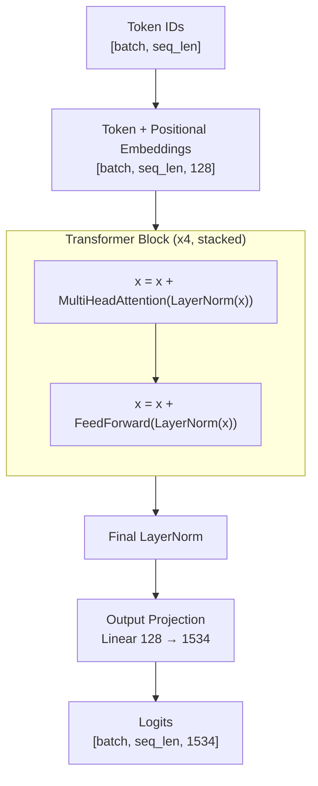

# GPT-Chess-From-Scratch

A GPT-style transformer built **completely from scratch in PyTorch** — no Hugging Face, no pre-built transformer layers, no shortcuts — trained on real human chess games to generate move sequences, one token at a time.

> **The pitch:** I built a mini version of ChatGPT, but instead of learning language, it learned chess. Same core mechanism (predict the next token, given everything so far) — just applied to move notation instead of English. Every piece — the tokenizer, the attention mechanism, the training loop, the sampling strategies — was implemented from raw math, not imported from a library.

---

## Table of contents

- [Why chess](#why-chess)
- [Architecture overview](#architecture-overview)
- [Build log, stage by stage](#build-log-stage-by-stage)
  - [Stage 0 — Environment setup](#stage-0--environment-setup)
  - [Stage 1 — Repo skeleton](#stage-1--repo-skeleton)
  - [Stage 2 — Dataset](#stage-2--dataset)
  - [Stage 3 — Tokenizer (BPE, from scratch)](#stage-3--tokenizer-bpe-from-scratch)
  - [Stage 4 — Embeddings](#stage-4--embeddings)
  - [Stage 5 — Single-head attention](#stage-5--single-head-attention)
  - [Stage 6 — Multi-head attention](#stage-6--multi-head-attention)
  - [Stage 7 — The full transformer block](#stage-7--the-full-transformer-block)
  - [Stage 8 — Assembling GPT + training](#stage-8--assembling-gpt--training)
  - [Stage 9 — Generation](#stage-9--generation)
  - [Stage 10 — Evaluation](#stage-10--evaluation)
- [Results](#results)
- [Honest limitations](#honest-limitations)
- [What's next](#whats-next)
- [How to run this yourself](#how-to-run-this-yourself)
- [Interview talking points](#interview-talking-points)

---

## Why chess

Most "I built an AI" portfolio projects call an existing model's API or fine-tune something pre-built. This project goes the other direction: build the actual internals — tokenizer, attention, training loop — from raw math, and train it on a domain that has zero ambiguity or grammar, to prove the architecture is genuinely general-purpose, not language-specific.

Chess also gives two things a language dataset doesn't:
- **A live, visual demo** — generated games can be rendered on an actual board, not just printed as text.
- **An objective, external correctness check** — `python-chess` can verify whether generated moves are actually legal, giving a second evaluation axis beyond training loss.

This is **not** a chess engine. It has no search, no lookahead, no explicit rules knowledge, and no concept of "winning." It is a pure next-token predictor that happens to have been trained on chess notation instead of prose — and its strengths and failures below are reported honestly, including where it breaks down.

---

## Architecture overview



**Model size:** ~1.2M parameters (roughly 100x smaller than GPT-2 small's 124M) — deliberately sized to train fast on a single free Colab T4 GPU while keeping every architectural piece genuinely present: multi-head attention, causal masking, residual connections, Pre-LN layer normalization, and a feed-forward network.

| Hyperparameter | Value |
|---|---|
| Vocabulary size | 1,534 (34 base chars + 1,500 BPE merges) |
| Embedding dimension | 128 |
| Attention heads | 4 (32-dim each) |
| Transformer blocks | 4 |
| Max sequence length | 128 |
| Feed-forward hidden dim | 512 (4x expansion) |

---

## Build log, stage by stage

### Stage 0 — Environment setup

**Decision: hybrid local + Colab workflow**, not a Colab-only notebook.

- **Local** (VSCode + venv + CPU PyTorch): writing/editing code, git operations, small shape-checks on toy tensors — none of which need a GPU.
- **Colab (free T4 GPU)**: used purely as a remote compute runtime. Each session clones the GitHub repo and *runs* the real `.py` files — it never contains hand-written model logic itself. This avoids the classic "notebook full of unstructured cells" problem entirely; the repo is the single source of truth from commit #1.
- Data and trained-artifact folders (`data/raw/`, `data/processed/`, `checkpoints/`) are `.gitignore`d — everything in them is **regenerated by scripts**, not committed. This makes the repo fully reproducible: clone it anywhere, rerun the pipeline, get the same result.

### Stage 1 — Repo skeleton

```
gpt-from-scratch/
├── src/
│   ├── data/      # download + clean data, tokenizer
│   ├── model/     # embeddings, attention, transformer block, GPT, generation
│   └── train/     # training loop, evaluation
├── data/          # gitignored — raw.pgn, tokenizer.json
├── checkpoints/   # gitignored — trained model weights
├── requirements.txt
└── README.md
```

### Stage 2 — Dataset

**Source:** [Lichess's public monthly game database](https://database.lichess.org) (April 2026 dump) — streamed and decompressed on the fly (`zstandard`), filtered, and stopped early once enough matching games were found, so the multi-GB source file is never fully downloaded.

**Filtering criteria:**
- Human games only (bot games excluded via header check)
- Both players rated **1600–2200 Elo** — consistent, sound intermediate play, not a mix of blunder-prone beginners and idiosyncratic grandmaster lines
- Zero-move (aborted) games dropped

**Final dataset: 15,000 games.**

**A real bug worth documenting:** the first version of the PGN parser was hand-written (manual blank-line detection to find game boundaries). It worked on small samples but silently produced 28 extra/fragmented records at scale (15,028 instead of exactly 15,000), with zero duplicate games — meaning the boundary-detection logic itself had an edge case, not the data. The fix: switch to `python-chess`'s built-in `chess.pgn.read_game()` parser, which structurally eliminates the class of bug entirely, since it actually parses each game into an object rather than guessing at text boundaries. **Lesson applied elsewhere in the project too:** reach for a well-tested library over hand-rolled parsing whenever one exists for the exact format in question.

Headers (`[Event ...]`, `[Site ...]`, etc.) make up **47.5% of the raw PGN file** — pure metadata irrelevant to move prediction. These are stripped entirely before training; only move text + game result is kept.

### Stage 3 — Tokenizer (BPE, from scratch)

Built a real Byte-Pair Encoding tokenizer from the ground up — not `tiktoken`, not HuggingFace's tokenizer.

**The algorithm:**
1. Start with a base vocabulary of individual characters (34 unique characters after header-stripping — just chess notation symbols: pieces, files, ranks, capture/check symbols).
2. Repeatedly find the most frequent **adjacent pair** of tokens across the corpus and merge it into a single new token.
3. Repeat for 1,500 merges → final vocabulary of **1,534 tokens**.

**A real performance problem, found and fixed during development:** the naive implementation re-scanned the entire 6.4-million-character corpus on every single merge iteration (~1,500 times) — projected runtime of several hours. The fix: since chess notation is extremely repetitive (only **4,475 unique words** exist across 1.6M word occurrences), pair-counting and merging were restructured to operate on **unique words weighted by frequency** instead of the raw character stream. This dropped training time to **3.8 seconds** — a concrete demonstration of recognizing "cheap-looking operation × large loop × large N" as a real complexity trap, and fixing it with an exact (not approximate) optimization.

**Result:** 2.97x compression ratio (4.8M characters → 1.6M tokens). Common patterns (`O-O`, `Nf3`, digit+`.` move numbers) collapse into single tokens; rare patterns stay split into smaller pieces.

### Stage 4 — Embeddings

Two learned lookup tables, added together:

- **Token embeddings** (`nn.Embedding(1534, 128)`): maps each token ID to a 128-dimensional learned vector — encodes *what* a token is.
- **Positional embeddings** (`nn.Embedding(128, 128)`): maps each sequence position to a 128-dimensional learned vector — encodes *where* in the sequence a token sits.

**Why positional info is needed at all:** attention (Stage 5) treats a sequence as an unordered set of tokens being compared pairwise — it has no inherent sense of order. Without positional embeddings, `e4 e5 Nf3` and `Nf3 e5 e4` would be indistinguishable to the model, which is fatal for chess, where move order is everything.

Output shape: `[batch_size, seq_len, 128]` — preserved through the rest of the network.

### Stage 5 — Single-head attention

The core mechanism, built and verified piece by piece with hand-traced shape predictions at every step.

**The formula:**

```
Attention(Q, K, V) = softmax( (Q · Kᵀ) / √d_k + causal_mask ) · V
```

- **Q (Query), K (Key), V (Value)** — three separate learned linear projections of the same input. Q/K exist purely to compute relevance scores between tokens (via dot product); V is the actual content that gets blended in once relevance is decided. Splitting these into three distinct vectors (rather than one shared vector) lets the model learn a matching mechanism independently of what content actually gets transmitted.
- **Q · Kᵀ** — a `[seq_len, seq_len]` matrix: every token's query compared against every other token's key, giving a relevance score for every pair.
- **Scaling by √d_k** — without this, dot-product magnitudes grow with vector dimension, pushing softmax into a regime with near-zero gradients and destabilizing training. Purely a training-stability fix, empirically motivated.
- **Causal masking** — before softmax, every "future" position (relative to the current token) is set to `-∞`. Since `softmax(-∞) = 0`, this guarantees zero attention weight on future tokens — mathematically exact, not approximate. Required because a next-token predictor must never see the answer it's trying to predict.
- **softmax** — converts raw relevance scores into a true probability distribution (sums to 1) per token — the actual "attention weights."
- **· V** — the final weighted blend: each token's new representation is a mixture of other tokens' Value vectors, weighted by how much attention was paid to each.

Verified with a concrete sanity check: the first token in a sequence, having no earlier context to attend to, produces attention weights of exactly `[1., 0., 0., ...]` — 100% on itself, confirming the causal mask works correctly.

### Stage 6 — Multi-head attention

Rather than one attention mechanism learning a single notion of "relevance," the embedding dimension is **split across multiple heads** (4 heads × 32 dimensions each, instead of one head × 128), each with its own independent Q/K/V projections. Each head can specialize in a different kind of relationship between tokens. Outputs are concatenated back to the original dimension and passed through one more learned linear layer (the output projection), which lets the model blend information across heads.

No new math beyond Stage 5 — structurally, this is "run the proven single-head mechanism several times in parallel, on smaller slices, then combine."

### Stage 7 — The full transformer block

```
x = x + MultiHeadAttention(LayerNorm(x))
x = x + FeedForward(LayerNorm(x))
```

- **Feed-forward network** — a small per-token MLP: `Linear(128→512) → GELU → Linear(512→128)`. The 4x expand-then-contract is standard GPT convention, giving the network extra representational capacity between the two projections. GELU (a smoothed version of ReLU, using the Gaussian CDF) is used instead of ReLU specifically because transformers empirically train more stably with it — no hard kink in the gradient at zero.
- **Residual connections** (`x = x + f(x)`) — give gradients an unobstructed shortcut path during backpropagation, which is what makes stacking many layers trainable at all rather than suffering from vanishing gradients.
- **Pre-LN** (normalize *before* each sub-layer, add to the raw residual) — the modern GPT-2 convention, chosen over the original 2017 Transformer paper's Post-LN because it keeps the residual path completely unnormalized/"clean," which trains more stably for deeper stacks.

Every piece — attention, feed-forward, the full block — preserves input shape `[batch, seq_len, 128]`, which is precisely what allows blocks to be stacked.

### Stage 8 — Assembling GPT + training

**Architecture:** embeddings → 4 stacked `TransformerBlock`s → final `LayerNorm` → output projection (`Linear(128 → 1534)`, sometimes called the "unembedding" or LM head) → logits over the full vocabulary, for every position in the sequence simultaneously.

**Total parameters: 1,202,430** (~1.2M) — roughly 100x smaller than GPT-2 small (124M).

**Training setup:**
- **Loss:** cross-entropy, computed over every position in every sequence simultaneously (input/target pairs constructed as the token sequence shifted by one position — "given tokens 0..i, predict token i+1").
- **Sanity check:** an untrained model with random weights should produce a loss near `ln(vocab_size) = ln(1534) ≈ 7.34` (uniform random guessing). Measured initial loss: **7.33–7.51** across runs — confirming the entire pipeline (embeddings → attention → FFN → output → loss) was wired correctly *before* any training happened.
- **Optimizer:** AdamW.
- **Learning rate schedule:** linear warmup (first ~2% of steps) → cosine decay to a minimum — standard GPT-style schedule, avoiding unstable large early updates while still taking small, precise steps late in training.
- **Checkpointing:** saved every 500 steps plus a guaranteed final save, specifically to survive Colab's free-tier runtime disconnects (which happened during this project and cost one full completed training run before a re-run — checkpoints/`files.download()` immediately after training is now a hard rule going forward).

**A real device bug, found on first Colab run:** `get_batch()` accepted a `device` parameter but never actually called `.to(device)` on the returned tensors — invisible on CPU-only local testing (everything already on the same device by coincidence), but immediately fatal on GPU (`RuntimeError: Expected all tensors to be on the same device`). Fixed by actually using the parameter. A good example of a bug class that only surfaces once you test on the real target environment, not just locally.

### Stage 9 — Generation

Given a trained model, generation repeatedly: run the model on the current sequence → look at the prediction for the last position → pick a next token → append it → repeat. Four decoding strategies were implemented, each a genuinely different tradeoff between coherence and variety:

| Strategy | Mechanism |
|---|---|
| **Greedy** | Always pick the single highest-probability token. Deterministic — same prompt always produces the same output. |
| **Temperature** | Sample from the full distribution; divide logits by `T` before softmax. Low `T` → sharper (approaches greedy); high `T` → flatter (more random, including more low-probability/implausible tokens). |
| **Top-k** | Restrict sampling to only the `k` most likely tokens, discard the rest, then sample among just those. |
| **Top-p (nucleus)** | Restrict sampling to the smallest set of tokens whose cumulative probability exceeds `p`. Unlike top-k, the pool size adapts — few candidates when the model is confident, more when it's uncertain. |

### Stage 10 — Evaluation

Training loss alone doesn't tell you whether generated chess makes sense. A second, independent evaluation axis was built using `python-chess`: play each generated move sequence onto a real board via `push_san()`, and measure **what fraction of moves are actually legal** before the first illegal move breaks the sequence.

This directly caught a real, interesting failure mode: a generated line included `4. d4 cxd4` (Black captures White's d-pawn — that pawn is now gone) followed later by `7. dxe5` (White capturing with a d-pawn that no longer exists on the board). The move was syntactically well-formed, common-*looking* notation — but the model has **no explicit board-state representation**, only pattern memory over move sequences, so it can't track that this specific game's history made the move impossible. This is an honest, expected limitation of pure sequence modeling without explicit state — not a training bug.

---

## Results

### Legality evaluation, 5,000 vs. 10,000 training steps

30 generations per strategy, 30 tokens each, prompted with `"1. e4"`.

| Strategy | 5,000 steps — legal % | 10,000 steps — legal % | Improvement |
|---|---|---|---|
| Greedy | 57.14% | 61.90% | +4.8pp |
| Temperature (T=1.0) | 42.17% | 55.40% | +13.2pp |
| Top-k (k=10) | 49.21% | 70.95% | **+21.7pp** |
| Top-p (p=0.9) | 52.70% | 61.43% | +8.7pp |

**Loss:** dropped from a theoretical random-init baseline of ~7.34 down to ~3.0–3.2 by 5,000 steps, continuing to improve through 10,000 steps.

**Reading these results honestly:**
- Every strategy improved with more training — strong evidence the model was still meaningfully learning at 5,000 steps, not yet plateaued.
- Top-k improved the most. As the model's judgment of "is this a good next token" got better with more training, its fixed-size top-10 candidate pool became increasingly filled with genuinely plausible moves — extra training disproportionately benefited exactly the kind of ranking top-k depends on.
- Greedy is deterministic — running it 30 times against the same prompt produces the *same* output 30 times. Its reported percentage reflects one real data point, not 30 independent trials; this is stated explicitly rather than implying more diversity than actually exists.
- Even the best result (~71%, top-k at 10K steps) means roughly 1 in 3 moves eventually breaks the position. That's expected and explainable given ~1.2M parameters and no explicit board-state tracking — not a shortcoming to hide.

---

## Honest limitations

- **No board-state representation.** The model infers "what's happening" purely from recent move-token patterns, never an explicit position. This is the single largest cause of illegal-move generation, and it gets worse the longer a game runs (earlier context can scroll out of the model's fixed context window).
- **Small scale by design.** 1.2M parameters and up to 10,000 training steps is intentionally modest — sized for fast iteration on a free GPU within a tight timeline, not for maximum play strength.
- **A known fix intentionally not used for core evaluation:** legality could trivially be pushed to ~100% via **constrained decoding** — at each generation step, use `python-chess` to filter the model's candidate tokens down to only those that are actually legal in the current position before sampling. This is a legitimate, real production technique. It was deliberately **not** used for the legality numbers reported above, because doing so would measure the external rules engine's correctness, not what the model itself actually learned about chess structure — and the honest story here is about the latter.

---

## What's next

- FastAPI backend wrapping the trained model, Dockerized, deployed on Google Cloud Run
- Static frontend with a live, move-by-move chess board visualization, deployed on Vercel
- Full write-up of the deployment architecture and a live demo link

---

## How to run this yourself

```bash
# environment
python3 -m venv venv
source venv/bin/activate
pip install -r requirements.txt

# regenerate data + tokenizer (reproducible from scratch, nothing pre-committed)
python3 -m src.data.download_games
python3 -m src.data.tokenizer

# train (GPU strongly recommended — see Colab workflow above)
python3 -m src.train.train

# generate
python3 -m src.model.generate

# evaluate legality across sampling strategies
python3 -m src.train.evaluate
```

---

## Interview talking points

- *"Why chess instead of the usual text dataset?"* — proves the transformer architecture is genuinely general-purpose, not language-specific; gives an objective, external correctness check (legality) beyond training loss alone.
- *"Walk me through attention."* — Q/K/V, the scaled dot-product formula, why scaling matters, why causal masking uses `-∞`, and the concrete shape trace from `[batch, seq_len, 128]` through to `[batch, seq_len, seq_len]` and back.
- *"What broke during this project, and how did you find it?"* — the PGN parsing edge case (fixed by switching to a proper parser), the BPE training performance trap (fixed by word-frequency deduplication), the CPU/GPU device mismatch bug (only surfaced on real GPU testing).
- *"How do you know the model is actually learning anything?"* — the `ln(vocab_size)` sanity check on initial loss, the loss curve trend, and the independent legality-rate evaluation as a second, non-loss-based signal.
- *"What would you do with more time/compute?"* — bigger model, more training steps and data (all cheap, proven-to-help levers per the 5K vs. 10K comparison above), and discussing constrained decoding as a known but deliberately-excluded technique for the core evaluation.
